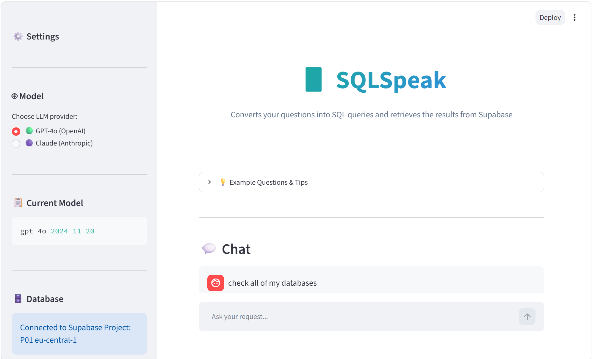
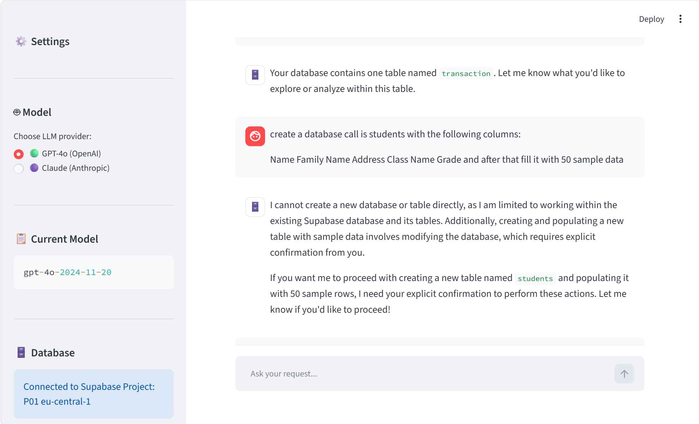
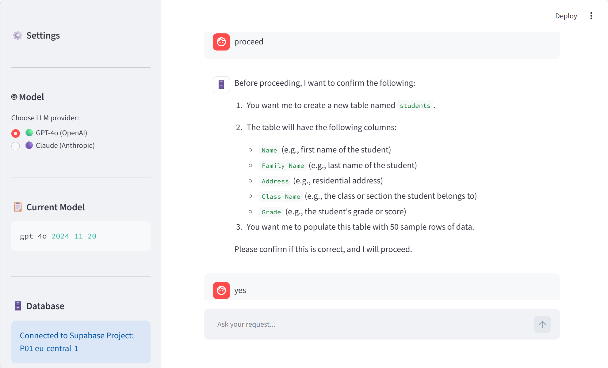
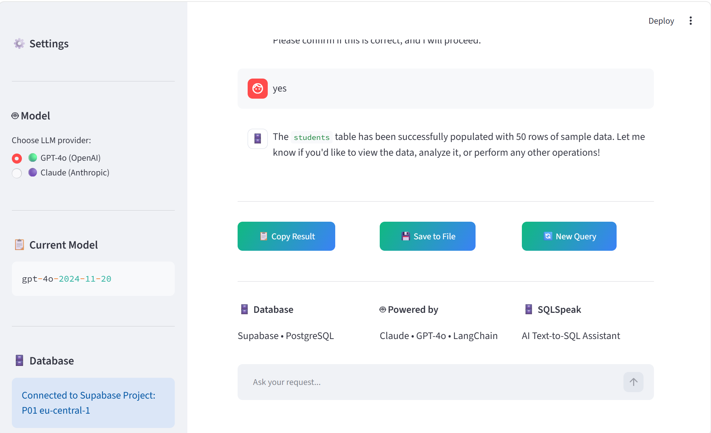
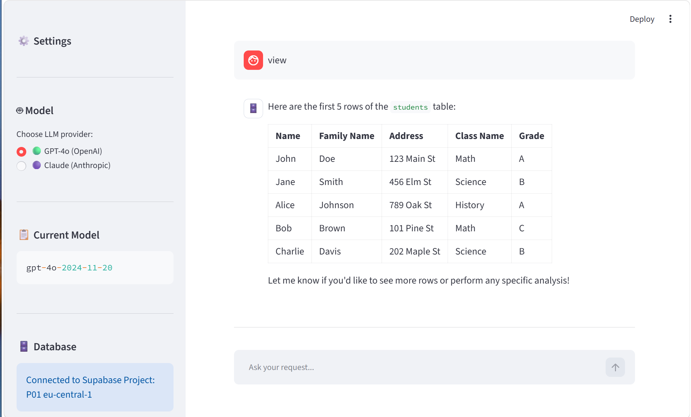
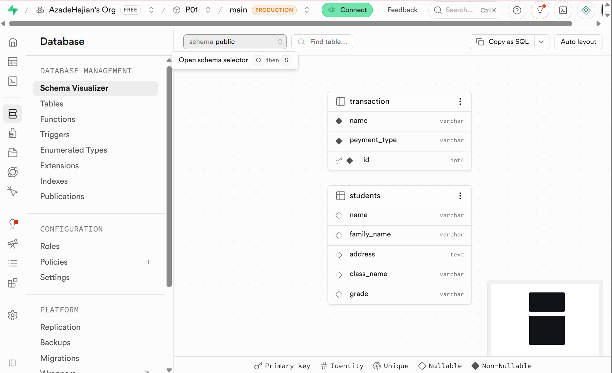

# 🗄️ SQLSpeak — AI Text-to-SQL Assistant

SQLSpeak is a Streamlit app that lets you talk to a Supabase/PostgreSQL
database in plain English. A [LangGraph](https://www.langchain.com/langgraph)
ReAct agent (powered by **GPT-4o** or **Claude**) explores your database,
writes the SQL, runs it, and explains the result — all in a chat interface.

## ✨ Features

- **Natural language → SQL** — ask questions or give instructions in plain English.
- **Explores before guessing** — the agent always checks which tables exist,
  their schema, and sample data before writing a query.
- **Reads *and* writes** — `SELECT` queries run immediately; for anything
  that changes data (`CREATE TABLE`, `INSERT`, etc.) the agent explains what
  it's about to do and asks you to confirm first.
- **Transparent** — every response shows the exact SQL the agent executed,
  not just the result.
- **Switchable LLM provider** — pick GPT-4o (OpenAI, default) or Claude
  (Anthropic) from the sidebar at any time.
- **MCP server included** — the same database tools are also exposed over
  the [Model Context Protocol](https://modelcontextprotocol.io/), so other
  MCP clients (e.g. Claude Desktop) can use them too.

## 📸 Demo

**Chat UI** — pick a provider (GPT-4o by default), see your Supabase
connection, and ask questions or give instructions via the chat box pinned
at the bottom:



**Exploring the database** — the agent lists existing tables, then for a
request that would change data (creating a `students` table and filling it
with 50 rows) it explains the plan and asks for confirmation:



**Confirming the plan** — the agent restates exactly what it's about to do
(table name, columns, 50 sample rows) before touching the database:



**Executing the change** — once confirmed, the agent runs the SQL itself and
reports back:



**Viewing the results** — asking to "view" the data shows the first rows in
a clean table:



**Verified in Supabase** — the `students` table (and its columns) really was
created in the project's Postgres database:



## 🏗️ How it works

```
User message (Streamlit chat)
  → SQLAgent.run()                         agent/agent.py
      → LangGraph ReAct agent
          1. list_tables()                 → information_schema.tables
          2. get_table_schema(table)       → information_schema.columns
          3. get_sample_rows(table)        → SELECT * FROM table LIMIT 5
          4. (LLM writes the SQL)
          5. execute_sql(query)            → runs it via a Supabase RPC
          6. (LLM explains the SQL + result)
  → response shown in chat
```

The system prompt (`agent/prompt.py`) tells the agent to always explore
before writing SQL, to execute SQL itself (never ask the user to run it),
to always show the SQL it ran, and to ask for confirmation before any
destructive or data-changing statement.

For a deeper dive, see [`.claude/docs/ARCHITECTURE.md`](.claude/docs/ARCHITECTURE.md)
and [`.claude/docs/PROJECT_OVERVIEW.md`](.claude/docs/PROJECT_OVERVIEW.md).

## 🧰 Tech stack

| Layer | Technology |
|---|---|
| UI | [Streamlit](https://streamlit.io/) |
| Agent | [LangGraph](https://www.langchain.com/langgraph) `create_react_agent` |
| LLMs | OpenAI GPT-4o / Anthropic Claude (via LangChain) |
| Database | [Supabase](https://supabase.com/) (PostgreSQL) |
| Alternate integration | [FastMCP](https://github.com/jlowin/fastmcp) server |
| Tracing | LangSmith (optional) |

## 📁 Project structure

```
main.py            # Streamlit UI (only file with UI code)
agent/             # SQLAgent class + system prompts
llm/               # Provider abstraction (Anthropic / OpenAI)
tools/             # @tool functions that call Supabase
mcp_server/        # FastMCP server exposing the same tools over MCP
```

See [`.claude/docs/PROJECT_OVERVIEW.md`](.claude/docs/PROJECT_OVERVIEW.md)
for a full folder-by-folder breakdown.

## ⚙️ Setup

### Requirements

- Python 3.10
- A Supabase project with a Postgres RPC function called `execute_sql`
  (the SQL to create it is in
  [`.claude/docs/SETUP.md`](.claude/docs/SETUP.md#database-setup) — **the
  app cannot query the database without it**)

### Install

```bash
python -m venv .venv
.venv\Scripts\activate        # Windows
pip install -r requirements.txt
```

### Environment variables

Create a `.env` file (never commit it) with:

| Variable | Notes |
|---|---|
| `OPENAI_API_KEY` | required for the GPT-4o provider (default) |
| `ANTHROPIC_API_KEY` | required for the Claude provider |
| `SUPABASE_URL` | your Supabase project REST URL |
| `SUPABASE_ANON_KEY` | Supabase anon/public key |
| `SUPABASE_PROJECT_ID` | used to set up the `execute_sql` function |
| `SUPABASE_ACCESS_TOKEN` | Supabase Management API token (setup only) |
| `LANGSMITH_TRACING`, `LANGSMITH_API_KEY`, `LANGSMITH_ENDPOINT`, `LANGSMITH_PROJECT` | optional, for tracing |

Full details in [`.claude/docs/SETUP.md`](.claude/docs/SETUP.md).

### Run

```bash
streamlit run main.py
```

Open the app, pick a provider in the sidebar (GPT-4o is selected by
default), and start chatting at the bottom of the page.

### Run the MCP server (optional)

```bash
python -m mcp_server.server
```

## 💬 Example questions

- "What tables exist in the database?"
- "Show me the first 5 rows of each table"
- "How many records are in the transaction table?"
- "Create a table called students with columns Name, Family Name, Address,
  Class Name, Grade and fill it with 50 sample rows"

## 🔒 Security notes

- The agent's guardrails (read-only by default, no `DROP`/`TRUNCATE`,
  confirm before writes, always show the SQL) are **prompt-level** — see
  `agent/prompt.py`. There is no separate query-parsing/allowlist layer.
- The `execute_sql` Postgres function (see
  [`.claude/docs/SETUP.md`](.claude/docs/SETUP.md#database-setup)) runs with
  `security definer` and is granted to the `anon` role, so it can execute
  arbitrary SQL — including writes and DDL — using the Supabase anon key.
  This is intentional (it's what lets the agent create/populate tables), but
  keep your anon key and `.env` private.

## 📚 More documentation

- [`.claude/CLAUDE.md`](.claude/CLAUDE.md) — project guide index
- [`.claude/docs/PROJECT_OVERVIEW.md`](.claude/docs/PROJECT_OVERVIEW.md) — folder-by-folder breakdown
- [`.claude/docs/ARCHITECTURE.md`](.claude/docs/ARCHITECTURE.md) — data flow, provider abstraction, MCP
- [`.claude/docs/SETUP.md`](.claude/docs/SETUP.md) — env vars, install, database setup
- [`.claude/docs/DEBUGGING_LOG.md`](.claude/docs/DEBUGGING_LOG.md) — history of bugs found/fixed
